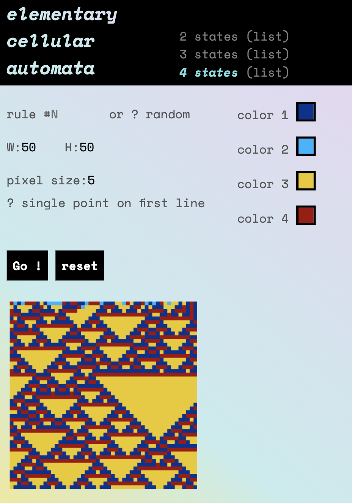

# Cellular automata

Image generation of 2, 3, 4 states cellular automata.

## [Use here](http://eliseduverdier.fr/cellular_automata/)

` GET /cellular_automata/img.php ? s=2 & ...`

| parameter name | shortcut | does |
|--------------|-------|---|
| states       | s     | The number of states   |
| order        | o     | The order (only `1` available for the moment) |
| width        | w     | The width in pixels    |
| height       | h     | The height in pixels   |
| pixel_size   | p     | A cell size in pixels  |
| rule_number  | n     | The rule number or `random` ( `{0 → 256}` for 2 states, `{0 → 134217728}` for 3, etc) (try `110` or `73` for 2 states) |
| random_start | start | The first line is random or a single centered point |
| color0       | bg    | The base color         |
| color1       | c1    | The first color        |
| color2       | c2    | The second color       |
| color3       | c3    | The third color, etc   |

All parameters are optional, default are defined for everything

## The code
That was my first personal project as a brand new developer :) The code was therefore very minimalist (if not plain dirty).

I'm occasionaly trying to keep it in shape and adding new features.

## Todo
- Clean routes
- Add a 2nd order generator (using also the nth-1 line)
- Clean the code, always

## Changelog
### [3.1] - 2021-03-10
- Finished refacto: finally following SOLID principles
- Now supporting any number of states (>2)

### [3.0] - 2021-03-10
- Another refactoring

### [2.0] - 2016-10-20
- Class refactoring

### [1.1] - 2016-30-30
- Added presentation page

### [1.0] - 2016-30-20
- Updated project.
