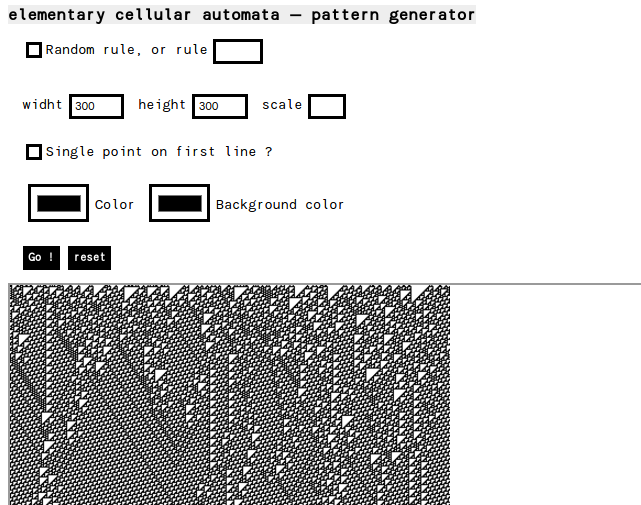

# Cellular automata

Image generation of two and three states cellular automata, in php 7.0.

Parameters:
  * Rule number (**rule** {int, 0 → 256} or {0 → 134217728} for 3-states)
  * Dimension of the image (**width** and **height** {int})
  * Size of one pixel (**pixel** {int})
  * Colors used for the states (**color** and **bgcolor** {#nnnnnn (0-f) | rbg(n,n,n) (0-255)}, + **middlecolor** for the 3-states)
  * If the first line is a single centered point, or random points. (**randomstart** {int} 1 (default) for random start, 0 for single point)

[Use here](http://eliseduverdier.fr/cellularAutomata/)

## Changelog
### [2.0] - 2016-10-20
- Class refactoring

### [1.1] - 2016-30-30
- Added presentation page

### [1.0] - 2016-30-20
- Updated project.
