# Cellular automata

Image or text rendering of {2→9}-states cellular automata.

## [Use here](https://eliseduverdier.fr/cellular_automata/)

- ` GET /cellular_automata/img.php ? s=2 & ...`
- ` GET /cellular_automata/text.php ? s=8 & ...`

| parameter name | shortcut | defines                                                                                                                |
| -------------- | -------- | ---------------------------------------------------------------------------------------------------------------------- |
| states         | s        | The number of states (2 to 9)                                                                                          |
| order          | o        | The order (`1` or `2`)                                                                                                 |
| width          | w        | The width in pixels                                                                                                    |
| height         | h        | The height in pixels                                                                                                   |
| pixel_size     | p        | A cell size in pixels                                                                                                  |
| rule_number    | n        | The rule number or `random` ( `{0 → 256}` for 2 states, `{0 → 134217728}` for 3, etc) (try `110` or `73` for 2 states) |
| random_start   | start    | The first line is random or a single centered point                                                                    |
| color0         | bg       | The base color                                                                                                         |
| color1         | c1       | The first color                                                                                                        |
| color2         | c2       | The second color                                                                                                       |
| color3         | c3       | The third color, etc                                                                                                   |

All parameters are optional, default are defined for everything

### The App

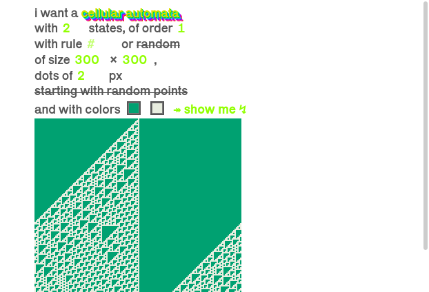

## How to use locally

From the folder, launch `php -S localhost:1234` and go to that url. Needs PHP8 (WIP: will run on docker later)

### Run tests

`php app/tests.php`

## The code

That was my first personal project as a brand new developer :) The code was therefore very minimalist (if not plain dirty).

I'm occasionaly trying to keep it in shape and adding new features. _The only rule is no framework, no external library, as much from scratch as possible_.

## TODO

- [x] Add more than 2 states
- [x] Make a text automata
- [x] Add 2nd order
- [ ] Add docker
- [x] Add tests

## Last changes ([see all](CHANGELOG.mg))

### [4.2] - 2021-08-23

- New UI

# Images

### First order

**2 states**

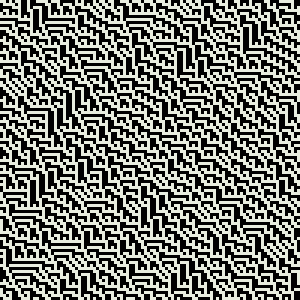 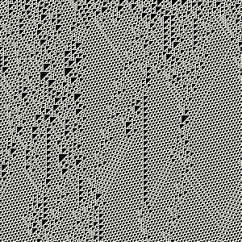 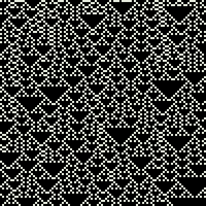 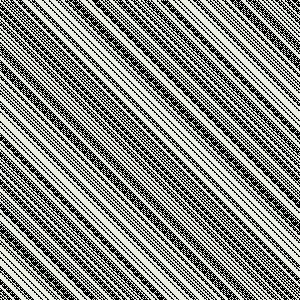 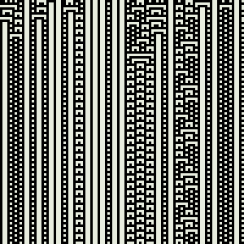

**3 states**

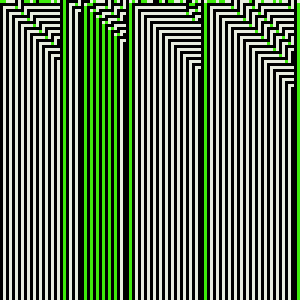 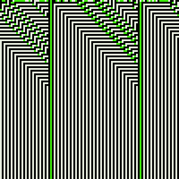 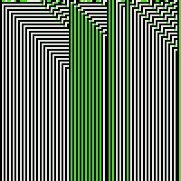 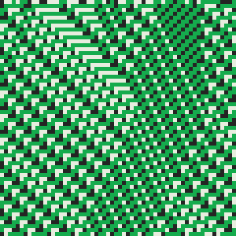 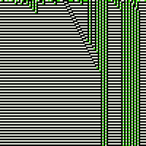 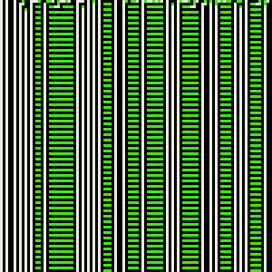 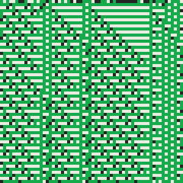

**5 states**

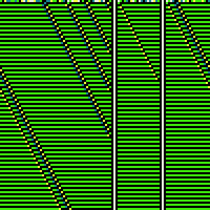

### Second order

**2 states**

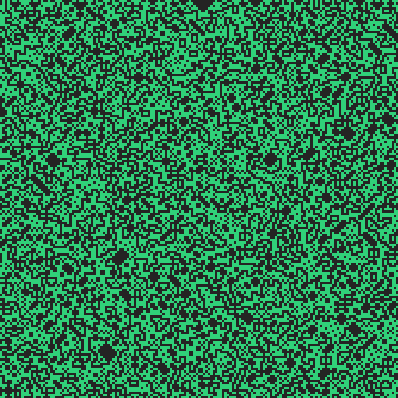 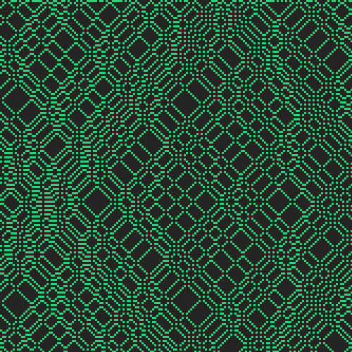 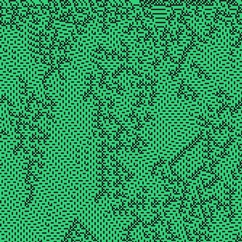 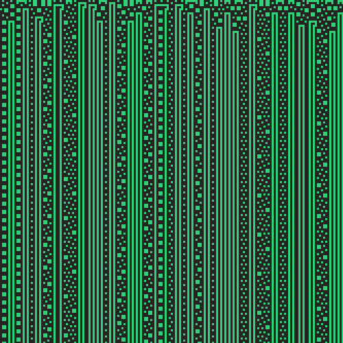

**5 states**

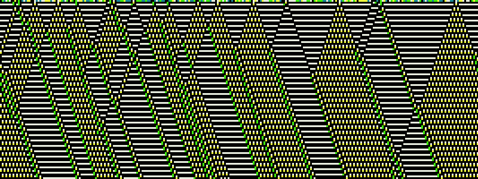 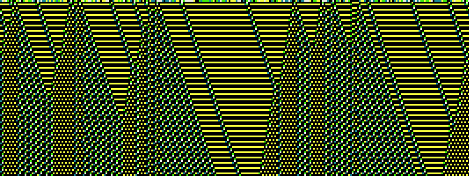

## Bonus

```
◌◌✻✻◉◌◌✻◉✻◌◌◌◌✻◌◉◌◉◉◌✻✻✻◉◌✻✻◌✻◌✻◉◉◉◉✻◌◌◌✻◉◌◉◌◌◌◌◌◉◉✻◌◌✻◉✻✻◉✻◌◌◌◌✻✻✻
◉◉◉◉◉◌◉◉◉◌◉◉◉◉◉◉◉◌◉✻◉◉◉◉◉◉◉◉◉◉◉◉◉◌◌◉◌◉◉◉◉◉◌◉◌◉◉◉◉◉◉◌◉◉◉◉◌◉◉◌◉◉◉◉◉◉◉
◌◌◌◌✻◌◉◌✻◌◉◌◌◌◌◌✻◌◉◉◉◌◌◌◌◌◌◌◌◌◌◌✻◌◉◉◌◉◌◌◌✻◌◉◌◉◌◌◌◌✻◌◉◌◌✻◌◉✻◌◉◌◌◌◌◌◌
◉◉◉◉◉◉◉◉◉◉◉◌◉◉◉◉◉◉◉◌✻◌◉◉◉◉◉◉◉◉◉◉◉◉◉✻◌◉◌◉◉◉◉◉◌◉◌◉◉◉◉◉◉◌◉◉◉◉◌◉◉◌◉◉◉◉◉
◌◌◌◌◌◌◌◌◌◌✻◌◉◌◌◌◌◌✻◉◉◉◉◌◌◌◌◌◌◌◌◌◌◌◉◌◉◉◌◉◌◌◌✻◌◉◌◉◌◌◌◌✻◌◉◌◌✻◌◉✻◌◉◌◌◌◌
◉◉◉◉◉◉◉◉◉◉◉◉◉◌◉◉◉◉◉◉◌◌✻◌◉◉◉◉◉◉◉◉◉◉◉◌◉✻◌◉◌◉◉◉◉◉◌◉◌◉◉◉◉◉◉◌◉◉◉◉◌◉◉◌◉◉◉
◌◌◌◌◌◌◌◌◌◌◌◌✻◌◉◌◌◌◌✻◌◉◉◉◉◌◌◌◌◌◌◌◌◌✻◌◉◌◉◉◌◉◌◌◌✻◌◉◌◉◌◌◌◌✻◌◉◌◌✻◌◉✻◌◉◌◌
◉◉◉◉◉◉◉◉◉◉◉◉◉◉◉◌◉◉◉◉◉◉◌◌✻◌◉◉◉◉◉◉◉◉◉◉◉◌◉✻◌◉◌◉◉◉◉◉◌◉◌◉◉◉◉◉◉◌◉◉◉◉◌◉◉◌◉
◌◌◌◌◌◌◌◌◌◌◌◌◌◌✻◌◉◌◌◌◌✻◌◉◉◉◉◌◌◌◌◌◌◌◌◌✻◌◉◌◉◉◌◉◌◌◌✻◌◉◌◉◌◌◌◌✻◌◉◌◌✻◌◉✻◌◉
◌◉◉◉◉◉◉◉◉◉◉◉◉◉◉◉◉◌◉◉◉◉◉◉◌◌✻◌◉◉◉◉◉◉◉◉◉◉◉◌◉✻◌◉◌◉◉◉◉◉◌◉◌◉◉◉◉◉◉◌◉◉◉◉◌◉◉
◌◉◌◌◌◌◌◌◌◌◌◌◌◌◌◌✻◌◉◌◌◌◌✻◌◉◉◉◉◌◌◌◌◌◌◌◌◌✻◌◉◌◉◉◌◉◌◌◌✻◌◉◌◉◌◌◌◌✻◌◉◌◌✻◌◉✻
◉◉◌◉◉◉◉◉◉◉◉◉◉◉◉◉◉◉◉◌◉◉◉◉◉◉◌◌✻◌◉◉◉◉◉◉◉◉◉◉◉◌◉✻◌◉◌◉◉◉◉◉◌◉◌◉◉◉◉◉◉◌◉◉◉◉◌
◉✻◌◉◌◌◌◌◌◌◌◌◌◌◌◌◌◌✻◌◉◌◌◌◌✻◌◉◉◉◉◌◌◌◌◌◌◌◌◌✻◌◉◌◉◉◌◉◌◌◌✻◌◉◌◉◌◌◌◌✻◌◉◌◌✻◌
◉◌◉◉◌◉◉◉◉◉◉◉◉◉◉◉◉◉◉◉◉◌◉◉◉◉◉◉◌◌✻◌◉◉◉◉◉◉◉◉◉◉◉◌◉✻◌◉◌◉◉◉◉◉◌◉◌◉◉◉◉◉◉◌◉◉◉
✻◌◉✻◌◉◌◌◌◌◌◌◌◌◌◌◌◌◌◌✻◌◉◌◌◌◌✻◌◉◉◉◉◌◌◌◌◌◌◌◌◌✻◌◉◌◉◉◌◉◌◌◌✻◌◉◌◉◌◌◌◌✻◌◉◌◌
◉◉◉◌◉◉◌◉◉◉◉◉◉◉◉◉◉◉◉◉◉◉◉◌◉◉◉◉◉◉◌◌✻◌◉◉◉◉◉◉◉◉◉◉◉◌◉✻◌◉◌◉◉◉◉◉◌◉◌◉◉◉◉◉◉◌◉
◌◌✻◌◉✻◌◉◌◌◌◌◌◌◌◌◌◌◌◌◌◌✻◌◉◌◌◌◌✻◌◉◉◉◉◌◌◌◌◌◌◌◌◌✻◌◉◌◉◉◌◉◌◌◌✻◌◉◌◉◌◌◌◌✻◌◉
◌◉◉◉◉◌◉◉◌◉◉◉◉◉◉◉◉◉◉◉◉◉◉◉◉◌◉◉◉◉◉◉◌◌✻◌◉◉◉◉◉◉◉◉◉◉◉◌◉✻◌◉◌◉◉◉◉◉◌◉◌◉◉◉◉◉◉
◌◉◌◌✻◌◉✻◌◉◌◌◌◌◌◌◌◌◌◌◌◌◌◌✻◌◉◌◌◌◌✻◌◉◉◉◉◌◌◌◌◌◌◌◌◌✻◌◉◌◉◉◌◉◌◌◌✻◌◉◌◉◌◌◌◌✻
◉◉◌◉◉◉◉◌◉◉◌◉◉◉◉◉◉◉◉◉◉◉◉◉◉◉◉◌◉◉◉◉◉◉◌◌✻◌◉◉◉◉◉◉◉◉◉◉◉◌◉✻◌◉◌◉◉◉◉◉◌◉◌◉◉◉◉
◌✻◌◉◌◌✻◌◉✻◌◉◌◌◌◌◌◌◌◌◌◌◌◌◌◌✻◌◉◌◌◌◌✻◌◉◉◉◉◌◌◌◌◌◌◌◌◌✻◌◉◌◉◉◌◉◌◌◌✻◌◉◌◉◌◌◌
◉◉◉◉◌◉◉◉◉◌◉◉◌◉◉◉◉◉◉◉◉◉◉◉◉◉◉◉◉◌◉◉◉◉◉◉◌◌✻◌◉◉◉◉◉◉◉◉◉◉◉◌◉✻◌◉◌◉◉◉◉◉◌◉◌◉◉
◌◌◌✻◌◉◌◌✻◌◉✻◌◉◌◌◌◌◌◌◌◌◌◌◌◌◌◌✻◌◉◌◌◌◌✻◌◉◉◉◉◌◌◌◌◌◌◌◌◌✻◌◉◌◉◉◌◉◌◌◌✻◌◉◌◉◌
◉◉◉◉◉◉◌◉◉◉◉◌◉◉◌◉◉◉◉◉◉◉◉◉◉◉◉◉◉◉◉◌◉◉◉◉◉◉◌◌✻◌◉◉◉◉◉◉◉◉◉◉◉◌◉✻◌◉◌◉◉◉◉◉◌◉◌
◉◌◌◌◌✻◌◉◌◌✻◌◉✻◌◉◌◌◌◌◌◌◌◌◌◌◌◌◌◌✻◌◉◌◌◌◌✻◌◉◉◉◉◌◌◌◌◌◌◌◌◌✻◌◉◌◉◉◌◉◌◌◌✻◌◉◌
◉◌◉◉◉◉◉◉◌◉◉◉◉◌◉◉◌◉◉◉◉◉◉◉◉◉◉◉◉◉◉◉◉◌◉◉◉◉◉◉◌◌✻◌◉◉◉◉◉◉◉◉◉◉◉◌◉✻◌◉◌◉◉◉◉◉◌
◉◌◉◌◌◌◌✻◌◉◌◌✻◌◉✻◌◉◌◌◌◌◌◌◌◌◌◌◌◌◌◌✻◌◉◌◌◌◌✻◌◉◉◉◉◌◌◌◌◌◌◌◌◌✻◌◉◌◉◉◌◉◌◌◌✻◌
◉◌◉◌◉◉◉◉◉◉◌◉◉◉◉◌◉◉◌◉◉◉◉◉◉◉◉◉◉◉◉◉◉◉◉◌◉◉◉◉◉◉◌◌✻◌◉◉◉◉◉◉◉◉◉◉◉◌◉✻◌◉◌◉◉◉◉
✻◌◉◌◉◌◌◌◌✻◌◉◌◌✻◌◉✻◌◉◌◌◌◌◌◌◌◌◌◌◌◌◌◌✻◌◉◌◌◌◌✻◌◉◉◉◉◌◌◌◌◌◌◌◌◌✻◌◉◌◉◉◌◉◌◌◌
◉◉◉◌◉◌◉◉◉◉◉◉◌◉◉◉◉◌◉◉◌◉◉◉◉◉◉◉◉◉◉◉◉◉◉◉◉◌◉◉◉◉◉◉◌◌✻◌◉◉◉◉◉◉◉◉◉◉◉◌◉✻◌◉◌◉◉
◌◌✻◌◉◌◉◌◌◌◌✻◌◉◌◌✻◌◉✻◌◉◌◌◌◌◌◌◌◌◌◌◌◌◌◌✻◌◉◌◌◌◌✻◌◉◉◉◉◌◌◌◌◌◌◌◌◌✻◌◉◌◉◉◌◉◌
◉◉◉◉◉◌◉◌◉◉◉◉◉◉◌◉◉◉◉◌◉◉◌◉◉◉◉◉◉◉◉◉◉◉◉◉◉◉◉◌◉◉◉◉◉◉◌◌✻◌◉◉◉◉◉◉◉◉◉◉◉◌◉✻◌◉◌
◉◌◌◌✻◌◉◌◉◌◌◌◌✻◌◉◌◌✻◌◉✻◌◉◌◌◌◌◌◌◌◌◌◌◌◌◌◌✻◌◉◌◌◌◌✻◌◉◉◉◉◌◌◌◌◌◌◌◌◌✻◌◉◌◉◉◌
◉◌◉◉◉◉◉◌◉◌◉◉◉◉◉◉◌◉◉◉◉◌◉◉◌◉◉◉◉◉◉◉◉◉◉◉◉◉◉◉◉◌◉◉◉◉◉◉◌◌✻◌◉◉◉◉◉◉◉◉◉◉◉◌◉✻◌
◉◌◉◌◌◌✻◌◉◌◉◌◌◌◌✻◌◉◌◌✻◌◉✻◌◉◌◌◌◌◌◌◌◌◌◌◌◌◌◌✻◌◉◌◌◌◌✻◌◉◉◉◉◌◌◌◌◌◌◌◌◌✻◌◉◌◉
```
